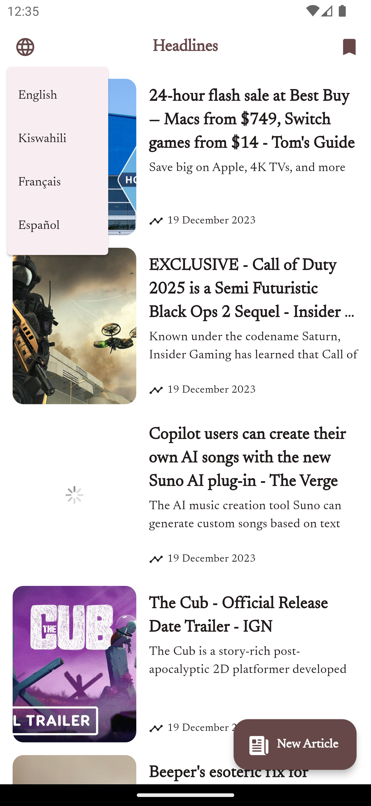

# Simple News App

A Flutter project that implements a simple news application.

## Provides a showcase for: 
- Clean architecture in Flutter (Data - Domain - Presentation pattern) ✅
- Calling an API ✅
- Authenticating an API ✅ (*Using an API key)
- Github Pipeline/Action ✅ (check out `deploy.yml`)
- Themeing ✅
- Language Translation (Localization/Internationalization) ✅
- Forms and Form Validation ✅
- State management using BLoC & Provider ✅
- Dependency injection ✅
- On-device storage (Room/Floor Database) ✅

## Screenshots
      